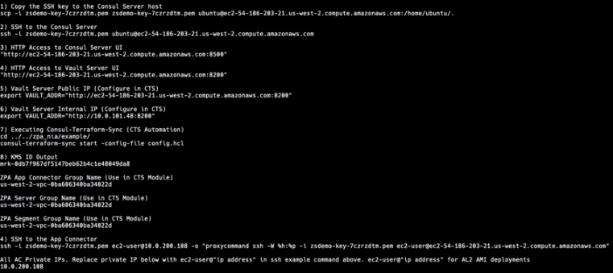

[](https://community.zscaler.com/)
[](https://forms.gle/3iMJvVmJDvmUy36q9)

<a href="https://terraform.io">
    
</a>

<a href="https://www.zscaler.com/">
    
</a>

# Zscaler Private Access Terraform & Consul Webinar - Zero Touch App Delivery with ZPA, Terraform & Consul

- This repository will provision Zscaler Private Access App Connector, Consul & NGINX servers in AWS. Optionally, you can also deploy a Vault Cluster in order to store the API credentials, so consul can retrieve it to authenticate to the ZPA Cloud.

# Demo Video

- In Progress

# Architecture


## Provision Infrastructure

The `terraform` directory has two sub-directories:

- `modules` contains dedicated modules to support the overall deployment of both AWS and ZPA constructs
  - `terraform-zpa-app-connector-group` deploys a dedicated ZPA App Connector Group
  - `terraform-zpa-provisioning-key` deploys a dedicated ZPA Provisioning key associated with the `terraform-zpa-app-connector-group` module
  - `terraform-zpa-server-group` deploys a dedicated ZPA Server Group
  - `terraform-zsac-acvm-aws` deploys a App Connector / AWS EC2 Instance
  - `terraform-zsac-asg-web-aws` deploys a AWS Auto-Scaling Group, which will deploy the NGIX web servers
  - `terraform-zsac-consul-server` deploys a dedicated consul and optionally a Vault Server
  - `terraform-zsac-iam-aws` creates an IAM role required for the Zscaler App Connectors, Consul Server and ASG.
  - `terraform-zsac-network-aws` deploys a dedicated network to support the consul-terraform-sync deployment
  - `terraform-zsac-sg-aws` deploys the required security groups to allow proper connectivity
- `base_ac` contains a dedicated example used to call each module to setup the environment on both AWS and Zscaler Private Access cloud.

## Prerequisites

To complete this tutorial, you need the following components as well as previous experience with Zscaler Private Access

1. A Zscaler Private Access tenant
2. Zscaler Private Access API Credentials. These credentials are used so that both Terraform and Consul-Terraform-Sync can authenticate to the ZPA cloud to create resources. If you don’t have ZPA API credentials, visit the Zscaler help portal or check out community article.
3. A single Consul datacenter with server and client nodes, and the configuration directory for Consul agents at /etc/consul.d/.
4. A running instance of the ZPA App Connector. If you don’t already, you can use the Terraform module provided in as part of this tutorial in order to deploy an App Connector VM based on Amazon Linux 2 instance (t2.micro). Visit help guide for more details.
5. Standard web server running on a node, listening on HTTP port 80. You will use NGINX in this tutorial.
6. A server with Consul-Terraform-Sync (CTS) installed. This server requires communication to the Consul datacenter for automation between these two products.
7. (Optional) A Server instance running Vault to store Zscaler’s API Credentials

You can set up the prerequisites on your own, or use the Terraform configuration in this repository to set up the entire tutorial environment. The tutorial will provide the detailed steps to set up the environment using the Terraform code provided in the repository.

To set up the environment in this repository, you must have the following pre-requisites install in your local machine:

- **Required**: [Terraform** => 1.0.0](https://releases.hashicorp.com/terraform)
- **Required** [Consul-Terraform-Sync => 0.7.0](https://releases.hashicorp.com/consul-terraform-sync)
- **Required** [ZPA API Credentials](https://registry.terraform.io/providers/zscaler/zpa/latest/docs)

# Step by Step

### **Step:1 - Clone the Repository**

- Clone the repository & change working directory to terraform

```sh
git clone https://github.com/zscaler/zpa-terraform-consul-webinar.git
cd zpa-terraform-consul-webinar
```

### **Step:2 - Setup AWS Credentials**

- To continue with the deployment, configure AWS credentials for your environment so that Terraform can authenticate with AWS to create resources.

```sh
export AWS_ACCESS_KEY_ID="<YOUR_AWS_ACCESS_KEY_ID>"
export AWS_SECRET_ACCESS_KEY="<YOUR_AWS_SECRET_ACCESS_KEY>"
```

> **NOTE:** If you have temporary AWS credentials, you must also add your ``AWS_SESSION_TOKEN`` as an environment variable. See the [AWS Provider Documentation](https://registry.terraform.io/providers/hashicorp/aws/latest/docs#environment-variables) for more details.

> **NOTE:** If you don't have access to IAM user credentials, use another authentication method described in the [AWS provider documentation](https://registry.terraform.io/providers/hashicorp/aws/latest/docs#environment-variables).

### **Step:3 - Setup Zscaler Private Access Credentials**

- Because the terraform module utilizes the Zscaler Private Access Terraform provider to set up the pre-requisites in the ZPA Cloud, you must set the ZPA API Key credentials using environment variables.

> **NOTE:** For more details about how to create the ZPA API Key credentials visit the [ZPA Terraform Provider documentation](https://registry.terraform.io/providers/zscaler/zpa/latest/docs) page

# Deploy Consul Datacenter

The Terraform code for deploying the Consul datacenter is located under the ``terraform/base_ac`` folder.

```sh
cd terraform/base_ac
```

- Create Terraform run
- Modify `terraform.tfvars.example` to customize the attributes based on your desired values
- Rename the `terraform.tfvars.example`

```sh
cp terraform.tfvars.example terraform.tfvars
```

Once the configuration is complete, you can deploy the infrastructure with Terraform.

```sh
terraform init
terraform plan
terraform apply
```

The following steps will occur:

- Create a ZPA App Connector VM, Consul, Vault (Optional), and NGINX Web Server instances in AWS
- Terraform will provide a step by step output with all the necessary information to access the environment



You can access your Consul datacenter UI using the address specified in output "3) HTTP Access to Consul Server UI"


From the Consul UI you can verify the datacenter contains 3 Web NGINX containers running on two different instances.

# Working with Consul-Terraform-Sync

Next, you will configure Consul-Terraform-Sync.
> **NOTE:** If you deployed the infrastructure using the provided terraform module, the configuration file ``config.hcl`` is produced automatically for you under the ``zpa_nia/example`` folder.

> **IMPORTANT:** Prior to executing the consul-terraform-sync daemon, make sure to authenticate with the ZPA API credentials using environment variables or Vault, so that Consul-Terraform-Sync can authenticate properly.

## Executing Consul-Terraform-Sync

Finally, you can start Consul-Terraform-Sync by executing the following command:

```sh
consul-terraform-sync start -config-file config.hcl
```

```sh
[INFO]  cli: v0.7.0 (e77f257)
[INFO]  ctrl: setting up controller: type=daemon
[INFO]  ctrl: initializing Consul client and testing connection
[INFO]  driver.terraform: skipping install, terraform already exists: tf_version=1.1.8 install_path=/Users/username/Desktop/zpa-terraform-consul-webinar/zpa_nia/example
[INFO]  cli: initializing controller
[INFO]  ctrl: initializing driver factory
[INFO]  template.hcltmpl: evaluating dynamic configuration for block: block_name=zpa
[INFO]  api: starting server: port=8558
[INFO]  ctrl: executing all tasks once through
[INFO]  ctrl: running task once: task_name=zpa_application_segment
[INFO]  client.terraformcli: Terraform logging is set, Terraform logs will output with Consul-Terraform-Sync logs
[INFO]  driver.terraform: retrieved 0 Terraform handlers for task: task_name=zpa_application_segment
[INFO]  templates.tftmpl: overwriting file in root module for task: file_name=variables.tf task_name=zpa_application_segment
[INFO]  templates.tftmpl: overwriting file in root module for task: file_name=variables.module.tf task_name=zpa_application_segment
[INFO]  templates.tftmpl: overwriting file in root module for task: file_name=terraform.tfvars.tmpl task_name=zpa_application_segment
[INFO]  templates.tftmpl: overwriting file in root module for task: file_name=providers.auto.tfvars task_name=zpa_application_segment
[INFO]  templates.tftmpl: overwriting file in root module for task: file_name=variables.auto.tfvars task_name=zpa_application_segment
[INFO]  templates.tftmpl: overwriting file in root module for task: file_name=main.tf task_name=zpa_application_segment
[INFO] running Terraform command: /Users/username/Desktop/zpa-terraform-consul-webinar/zpa_nia/example/terraform version -json
  "terraform_version": "1.1.8",
  "platform": "darwin_amd64",
  "provider_selections": {
    "registry.terraform.io/zscaler/zpa": "2.7.0"
  },
  "terraform_outdated": true
}
```

The Consul-Terraform-Sync execution, will automatically, create a new application segment within the Zscaler Private Access portal, containing the FQDNs of each one of our web servers with its corresponding service ports


# How to test?

Once all the components are deployed and connectivity is fully established, you can test access to the backend applications by:

- Connect to the Zscaler infrastructure using the [Zscaler Client Connector Agent](https://help.zscaler.com/z-app/what-zscaler-app)


- The NGINX servers are already in an Auto scaling group with consul agents running and sending all information to Consul server.
- Use case is when you destroy or bring down one of the NGINX server, Consul will automatically deregister the removed servers, and trigger a call to Consul-Terraform-Sync, which in turn will update the Zscaler Private Access Application Segment domain entries by removing the servers.
- As the NGINX web servers are going up and down Consul-Terraform-Sync automatically updates the application segments without manual intervention.
- Use http://consul_public_IP:8500 to access the consul server and check the status of consul nodes count


### Product Versions

- **Required**: [ZPA Terraform Provider => v2.7.0](https://github.com/zscaler/terraform-provider-zpa/releases/tag/v2.7.9)
- **Required**: [Terraform** => 1.2.6](https://releases.hashicorp.com/terraform/1.2.6)
- **Required**: [Consul => 1.15.1](https://releases.hashicorp.com/consul/1.15.1)
- **Required** [Consul-Terraform-Sync => 0.7.0](https://releases.hashicorp.com/consul-terraform-sync/0.7.0/consul-terraform-sync_0.7.0_linux_amd64.zip)
- **Optional**: [Vault => 1.13.1](https://releases.hashicorp.com/vault/1.13.1/vault_1.13.1_linux_amd64.zip)
