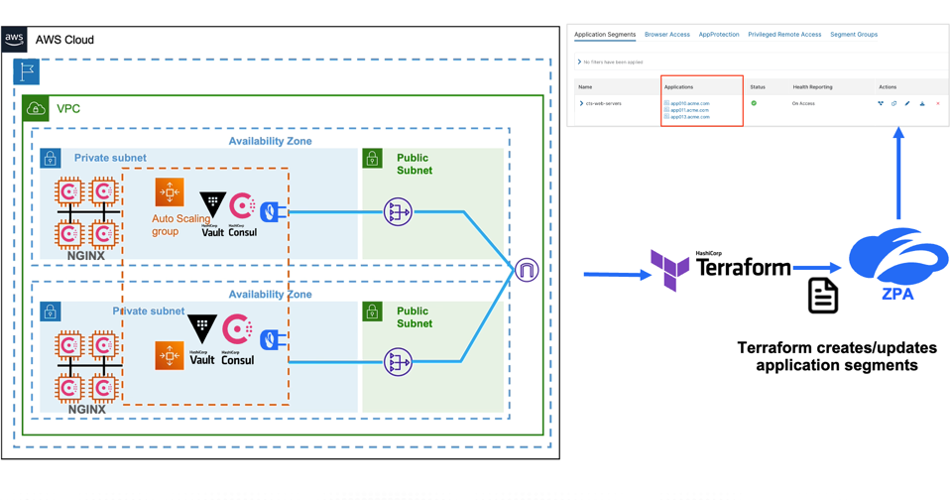
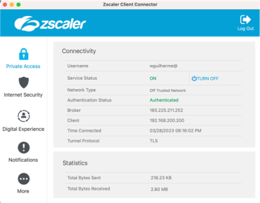
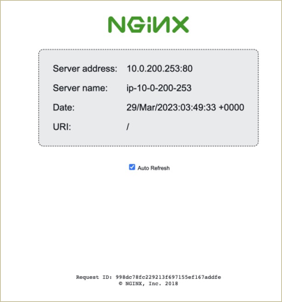
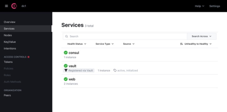
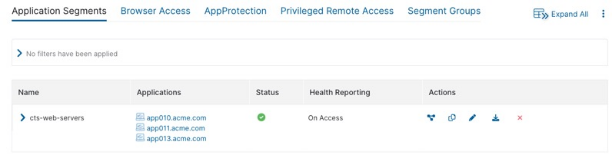

[](https://community.zscaler.com/)
[](https://forms.gle/3iMJvVmJDvmUy36q9)

<a href="https://terraform.io">
    
</a>

<a href="https://www.zscaler.com/">
    
</a>

# Zscaler Private Access Terraform & Consul Webinar - Zero Touch App Delivery with ZPA, Terraform & Consul

This repository will provision Zscaler Private Access App Connector, Consul & NGINX servers in AWS. Optionally, you can also deploy a Vault Cluster to store your ZPA API credentials, so Consul can authenticate to the ZPA Cloud.

# Demo Video

- In Progress

# Architecture



## Provision Infrastructure

The `terraform` directory has two sub-directories:

- `modules` contains dedicated modules to support the overall deployment of both AWS and ZPA constructs
  - `terraform-zpa-app-connector-group` deploys a dedicated ZPA App Connector Group
  - `terraform-zpa-provisioning-key` deploys a dedicated ZPA Provisioning key associated with the `terraform-zpa-app-connector-group` module
  - `terraform-zpa-server-group` deploys a dedicated ZPA Server Group
  - `terraform-zsac-acvm-aws` deploys a App Connector / AWS EC2 Instance
  - `terraform-zsac-asg-web-aws` deploys a AWS Auto-Scaling Group, which will deploy the NGIX web servers
  - `terraform-zsac-consul-server` deploys a dedicated consul and optionally a Vault Server
  - `terraform-zsac-iam-aws` creates an IAM role required for the Zscaler App Connectors, Consul Server and ASG.
  - `terraform-zsac-network-aws` deploys a dedicated network to support the consul-terraform-sync deployment
  - `terraform-zsac-sg-aws` deploys the required security groups to allow proper connectivity
- `base_ac` contains a dedicated example used to call each module to setup the environment on both AWS and Zscaler Private Access cloud.

## Prerequisites

To complete this tutorial, you need the following components as well as previous experience with Zscaler Private Access

1. A Zscaler Private Access tenant
2. Zscaler Private Access API Credentials. These credentials are used so that both Terraform and Consul-Terraform-Sync can authenticate to the ZPA cloud to create resources. If you don’t have ZPA API credentials, visit the Zscaler help portal or check out community article.
3. A single Consul datacenter with server and client nodes, and the configuration directory for Consul agents at `/etc/consul.d/`.
4. A running instance of the ZPA App Connector. If you don’t already, you can use the Terraform module provided in as part of this tutorial to deploy an App Connector VM based on Amazon Linux 2 instance (`t2.micro`).
5. Standard web server running on a node, listening on HTTP port `80`. You will use NGINX in this tutorial.
6. A server with Consul-Terraform-Sync (CTS) installed. This server requires communication to the Consul datacenter for automation between these two products.
7. (Optional) A Server instance running Vault to store Zscaler’s API Credentials

You can set up the prerequisites on your own, or use the Terraform configuration in this repository to set up the entire tutorial environment. The tutorial will provide the detailed steps to set up the environment using the Terraform code provided in the repository.

To set up the environment in this repository, you must have the following pre-requisites install in your local machine:

- **Required**: [Terraform** => 1.0.0](https://releases.hashicorp.com/terraform)
- **Required** [Consul-Terraform-Sync => 0.7.0](https://releases.hashicorp.com/consul-terraform-sync)
- **Required** [ZPA API Credentials](https://registry.terraform.io/providers/zscaler/zpa/latest/docs)

# Tutorial

This tutorial provides an example scenario that can be deployed in AWS using Terraform.

- [Clone example repository](#clone-example-repository)
- [Provision Infrastructure](#provision-infrastructure)
- [Configure CTS](#configure-cts)
- [Start CTS](#start-cts)
- [Verify NIA automation workflow](#verify-nia-automation-workflow)
- [Clean your environment](#clean-your-environment)

### Clone example repository

First, clone the repository.

```
git clone https://github.com/zscaler/zpa-terraform-consul-webinar.git
```

Next, navigate to the repository’s root folder.

```
cd zpa-terraform-consul-webinar
```

#### Set up AWS credentials

The demo code deploys a Consul datacenter on AWS and the ZPA App Connector instances.

First, configure AWS credentials for your environment so that Terraform can authenticate with AWS to create resources.

Set your AWS access key ID as an environment variable.

```
export AWS_ACCESS_KEY_ID="<YOUR_AWS_ACCESS_KEY_ID>"
```

Now, set your secret key.

```
export AWS_SECRET_ACCESS_KEY="<YOUR_AWS_SECRET_ACCESS_KEY>"
```

If you have temporary AWS credentials, you must also add your `AWS_SESSION_TOKEN` as an environment variable.

> **Note**
> If you don't have access to IAM user credentials, refer to the [AWS provider documentation](https://registry.terraform.io/providers/hashicorp/aws/latest/docs) to learn how to use another authentication method.

#### Set up Zscaler private access credentials

Since the Terraform module uses the Zscaler Private Access Terraform provider to set up the pre-requisites in the ZPA Cloud, you must set the ZPA API Key credentials using environment variables.

```
export ZPA_CLIENT_ID="xxxxxxxxxxxxxxxx"
export ZPA_CLIENT_SECRET="xxxxxxxxxxxxxxxx"
export ZPA_CUSTOMER_ID="xxxxxxxxxxxxxxxx"
```


For more details about how to create the ZPA API Key credentials, refer to the [ZPA Terraform provider documentation](https://registry.terraform.io/providers/zscaler/zpa/latest/docs).
### Provision Infrastructure

The Terraform configuration for deploying the Consul datacenter is located under the `terraform/base_ac` folder.

Navigate to the `terraform/base_ac` folder.

```
cd terraform/base_ac
```

Use the `terraform.tfvars.example` template file to create a `terraform.tfvars`.

```
$ cp terraform.tfvars.example terraform.tfvars
```

Edit the file to customize the attributes based on your desired values. Once you have configured this file to your environment, you can deploy the infrastructure with Terraform.

First, initialize your Terraform directory.

```
terraform init
```

Then, apply the changes to provision the base infrastructure. Enter `yes` to confirm the run.

```
terraform apply
```

This may take several minutes to complete. Once Terraform completes, it will return something similar to the following. This output displays the information that you can use to access your infrastructure.

```
Apply complete! Resources: 55 added, 0 changed, 0 destroyed.

Outputs:

1) SSH to the Consul Server
ssh -i zsdemo-key-ozsjit6n.pem ubuntu@ec2-52-41-0-77.us-west-2.compute.amazonaws.com

2) HTTP Access to Consul Server UI
"http://ec2-52-41-0-77.us-west-2.compute.amazonaws.com:8500"

3) HTTP Access to Vault Server UI
"http://ec2-52-41-0-77.us-west-2.compute.amazonaws.com:8200"

4) Vault Server Public IP (Configure in CTS)
export VAULT_ADDR="http://ec2-52-41-0-77.us-west-2.compute.amazonaws.com:8200"

5) Vault Server Internal IP (Configure in CTS)
export VAULT_ADDR="http://10.0.101.210:8200"

6) Executing Consul-Terraform-Sync (CTS Automation)
cd ../../zpa_nia/example/
consul-terraform-sync start -config-file config.hcl

7) KMS ID Output
mrk-80709f525e7942f1bc5ef9ba2f8312da

8) ZPA Objects Created for Use with CTS Module
ZPA App Connector Group Name (Used in CTS Module)
us-west-2-vpc-05990a57fd9219307

ZPA Server Group Name (Used in CTS Module)
us-west-2-vpc-05990a57fd9219307

ZPA Segment Group Name (Used in CTS Module)
us-west-2-vpc-05990a57fd9219307

9) SSH to the App Connector
ssh -i zsdemo-key-ozsjit6n.pem ec2-user@10.0.200.211
```

#### Verify access to private web servers

Conceptually, all web servers are hosted behind the Zscaler Private Access infrastructure and not accessible to the outside world. For this reason, you need to be connected to the Zscaler cloud using the Zscaler Client Connector agent.

Connect to the Zscaler infrastructure using the Zscaler Client Connector Agent.



Once you have connected to the client connector agent, access one of the web servers provisioned as part of the autoscaling group.



#### Verify Consul services

Open the Consul UI by opening the address specified in output `2) HTTP Access to Consul Server UI` in your browser. Then, verify that your Consul datacenter contains 3 Web NGINX containers running on two different instances.



#### Configure Vault (optional)

The Terraform module also deploys Vault to store the Zscaler Private Access API credentials. Expand the dropdown to initialize Vault. You only need to do this if you want to use Vault to store the Zscaler credentials instead of environment variables.

<details>
<summary>Authenticate with Vault</summary>

In addition to deploying the base infrastructure, the tutorial Terraform module also auto-initialize Vault and auto-unseal. For this reason, you do not need to manually initialize Vault.

> **Note**
> The Vault configuration in this tutorial leverages AWS Auto-Unseal option. As a result, when you created the base configuration, Terraform created an AWS KMS.

Retrieve the Terraform output to retrieve the SSH information.

```
terraform output
```

You should find something similar to the following. Run this command in your terminal to connect to your Consul/Vault server.

```
2) SSH to Consul/Vault Server
ssh -i zsdemo-key-ozsjit6n.pem ubuntu@ec2-52-41-0-77.us-west-2.compute.amazonaws.com
```

In the Vault instance, retrieve the Vault recovery keys and the initial root token.

```
sudo cat  /home/ubuntu/vault_tokens.log
```

This should return something similar to the following:

```
root@ip-10-0-101-210:/home/ubuntu# cat vault_tokens.log
Recovery Key 1: jKg7iLtS2lDvnJiK5ThE/Sl9A9RwfIfkjTt9QvupJR7e
Recovery Key 2: AuuSA5zGNjXTXHXbPJLPSfTgSQJDpARrOxXW9MdzCJ0y
Recovery Key 3: dhW8ypggqluVx9iZ+2Zi4xbqaYkLAgbpNLxFg64sb1/R
Recovery Key 4: YDrA3JCebNs1jRf3tzHHPXd9u58TZX+uoNB8JD+prV4E
Recovery Key 5: g4FOj68I6f0Ih8WopEzL3QMlbBzca0cH85WrGCsrhHfi

Initial Root Token: hvs.dZg9EGZYhO4UYC7Vk1GAAy3V

Success! Vault is initialized

Recovery key initialized with 5 key shares and a key threshold of 3. Please securely distribute the key shares printed above.
```

If Terraform deployed the Consul datacenter successfully, you should find the Vault as a registered service within the Consul UI.

In your terminal, set the following environment variables so that Terraform can authenticate to the Vault server to create your credentials.

```
Vault Server Public IP (Configure in CTS)
export VAULT_TOKEN="hvs.CE4FLQ4svXql0W6L7HEv3HSL"
export VAULT_ADDR="http://ec2-52-41-0-77.us-west-2.compute.amazonaws.com:8200"
```

Navigate to the Vault directory.

```
cd zpa-terraform-consul-webinar/vault
```

Open `zpa-terraform-consul-webinar/vault/main.tf`.

Replace all `REPLACE_ME` in the `vault_kv_secret_v2.zpacloudprod` resource with your respective Zscaler credentials. This will store the credentials in Vault. You only need to update the `client_id`, `client_secret`, and `customer_id` attributes.

```
resource "vault_kv_secret_v2" "zpacloudprod" {
  mount = vault_mount.zscaler.path
  name = "zpacloudprod"
  delete_all_versions = true
  data_json = jsonencode(
  {
    client_id ="REPLACE_ME",
    client_secret = "REPLACE_ME",
    customer_id = "REPLACE_ME"
  }
  )
}
```

Initialize and apply the Terraform configuration to mount Vault and create a KV secret.

```
terraform init && terraform apply –-auto-approve
```

Once Terraform completes, it will return something similar to the following:

```
Plan: 2 to add, 0 to change, 0 to destroy.
vault_mount.zscaler: Creating...
vault_mount.zscaler: Creation complete after 0s [id=zscaler]
vault_kv_secret_v2.zpacloudprod: Creation complete after 0s [id=zscaler/data/zpacloudprod]

Apply complete! Resources: 2 added, 0 changed, 0 destroyed.
```

</details>

### Configure CTS

Once you have deploy the base infrastructure, you can use Consul-Terraform-Sync (CTS) to monitor the changes in your web server instances and modify your ZPA Application Segment configuration without a ZPA administrator.

First, navigate to the `zpa_nia/example` directory.

```
cd ../../zpa_nia/example
```

Then, you will configure CTS.

> **Note**
> If you deployed the infrastructure using the Terraform module, the module automatically creates the configuration file (`config.hcl`) in the `zpa_nia/example` folder. The following is an example configuration file generated by the Terraform module.

```
driver "terraform" {
  log = true
  required_providers {
    zpa = {
      source = "zscaler/zpa"
    }
  }
}

# Consul Config Options
consul {
  address = "52.41.0.77:8500"
}

# Vault Config Options (Optional)
# Only required if you are using Vault to retrieve ZPA API Credentials
vault {}

################################################################################
# For Customer utilizing Vault to Store ZPA API Credentials, enable this field
################################################################################
terraform_provider "zpa" {
  zpa_client_id = "{{ with secret \"zscaler/zpacloudprod\" }}{{ .Data.data.client_id }}{{ end }}"
  zpa_client_secret = "{{ with secret \"zscaler/zpacloudprod\" }}{{ .Data.data.client_secret }}{{ end }}"
  zpa_customer_id = "{{ with secret \"zscaler/zpacloudprod\" }}{{ .Data.data.customer_id }}{{ end }}"
}

/*
terraform_provider "zpa" {
  zpa_client_id       = "{{ env \"ZPA_CLIENT_ID\" }}"
  zpa_client_secret   = "{{ env \"ZPA_CLIENT_SECRET\" }}"
  zpa_customer_id     = "{{ env \"ZPA_CUSTOMER_ID\" }}"
}
*/
task {
  name = "zpa_application_segment"
  description = "This task dynamically updates application segments domain names, tcp ports"
  module = "../"
  providers = ["zpa"]
  condition "services" {
    names = ["web"]
  }
  variable_files = ["./terraform.tfvars"]
}
```

Before you start the `consul-terraform-sync` daemon, make sure authenticate with the ZPA API credentials using environment variables or Vault so that CTS can authenticate properly.

<details>
<summary>Authenticate with Vault</summary>
If you deployed this tutorial using the Terraform module provided in this GitHub Repository, you can optionally set up Vault to store the Zscaler Private Access API credentials.

To leverage Vault, make sure to enable the following attributes as per configuration displayed below:

```
# Vault Config Options (Optional)
# Only required if you are using Vault to retrieve ZPA API Credentials
vault {}

################################################################################
# For Customer utilizing Vault to Store ZPA API Credentials, enable this field
################################################################################
terraform_provider "zpa" {
  zpa_client_id = "{{ with secret \"zscaler/zpacloudprod\" }}{{ .Data.data.client_id }}{{ end }}"
  zpa_client_secret = "{{ with secret \"zscaler/zpacloudprod\" }}{{ .Data.data.client_secret }}{{ end }}"
  zpa_customer_id = "{{ with secret \"zscaler/zpacloudprod\" }}{{ .Data.data.customer_id }}{{ end }}"
}
```

</details>

<details>
<summary>Authenticate with environment variables</summary>

Make sure to enable the following attributes in your CTS `config.hcl` file located within the `zpa_nia` example folder per the configuration displayed below:

```
terraform_provider "zpa" {
  zpa_client_id       = "{{ env \"ZPA_CLIENT_ID\" }}"
  zpa_client_secret   = "{{ env \"ZPA_CLIENT_SECRET\" }}"
  zpa_customer_id     = "{{ env \"ZPA_CUSTOMER_ID\" }}"
}

You still need to set your credentials using environment variables as per the example below:

For example:
export ZPA_CLIENT_ID="xxxxxxxxxxxxxxxx"
export ZPA_CLIENT_SECRET="xxxxxxxxxxxxxxxx"
export ZPA_CUSTOMER_ID="xxxxxxxxxxxxxxxx"

For details about the authentication methods supported by the ZPA Terraform Provider, visit the provider documentation in the Terraform Registry here.
```

</details>

### Start CTS

Finally, start CTS.

```
consul-terraform-sync start -config-file config.hcl
```

This should return something similar to the following:

```
[INFO]  cli: v0.7.0 (e77f257)
[INFO]  ctrl: setting up controller: type=daemon
[INFO]  ctrl: initializing Consul client and testing connection
[INFO]  driver.terraform: skipping install, terraform already exists: tf_version=1.1.8 install_path=/Users/username/Desktop/zpa-terraform-consul-webinar/zpa_nia/example
[INFO]  cli: initializing controller
[INFO]  ctrl: initializing driver factory
[INFO]  template.hcltmpl: evaluating dynamic configuration for block: block_name=zpa
[INFO]  api: starting server: port=8558
[INFO]  ctrl: executing all tasks once through
[INFO]  ctrl: running task once: task_name=zpa_application_segment
[INFO]  client.terraformcli: Terraform logging is set, Terraform logs will output with Consul-Terraform-Sync logs
[INFO]  driver.terraform: retrieved 0 Terraform handlers for task: task_name=zpa_application_segment
[INFO]  templates.tftmpl: overwriting file in root module for task: file_name=variables.tf task_name=zpa_application_segment
[INFO]  templates.tftmpl: overwriting file in root module for task: file_name=variables.module.tf task_name=zpa_application_segment
[INFO]  templates.tftmpl: overwriting file in root module for task: file_name=terraform.tfvars.tmpl task_name=zpa_application_segment
[INFO]  templates.tftmpl: overwriting file in root module for task: file_name=providers.auto.tfvars task_name=zpa_application_segment
[INFO]  templates.tftmpl: overwriting file in root module for task: file_name=variables.auto.tfvars task_name=zpa_application_segment
[INFO]  templates.tftmpl: overwriting file in root module for task: file_name=main.tf task_name=zpa_application_segment
[INFO] running Terraform command: /Users/username/Desktop/zpa-terraform-consul-webinar/zpa_nia/example/terraform version -json
{
  "terraform_version": "1.1.8",
  "platform": "darwin_amd64",
  "provider_selections": {
    "registry.terraform.io/zscaler/zpa": "2.7.0"
  },
  "terraform_outdated": true
}
```

The CTS execution will automatically create a new application segment within the Zscaler Private Access portal, containing the FQDNs of each one of the web servers with its corresponding service ports.



### Verify NIA automation workflow

This scenario will trigger CTS by increasing the number of servers allocated to the autoscaling group. CTS will update the ZPA application segment configuration to include the new NGINX instances created by increasing the autoscaling group capacity.

In `/terraform/base_ac`, open the `terraform.tfvars` file and update the `desired capacity` and `max_size` values for the autoscaling group variables from `2` to `4`. The following snippet shows the original autoscaling group variables.

```
## 7. The minimum number of Web Servers to maintain in an Autoscaling group. (Default: 2)
desired_capacity                           = 2
min_size                                   = 1
max_size                                   = 2
```

Apply the changes to increase the number of servers in your autoscaling group.

```
terraform apply --auto-approve
```

Once Terraform completes, it will return something similar to the following:

```
An execution plan has been generated and is shown below.
Resource actions are indicated with the following symbols:
  ~ update in-place

Terraform will perform the following actions:

  # aws_autoscaling_group.web_asg will be updated in-place
  ~ resource "aws_autoscaling_group" "web_asg" {

    ## ...
      ~ desired_capacity          = 2 -> 4
        id                        = "zsdemo-web-asg-47d6j97s"
      ~ max_size                  = 2 -> 4
        name                      = "zsdemo-web-asg-47d6j97s"
    ## ...
    }
Plan: 3 to add, 3 to change, 0 to destroy.

## ...
Apply complete! Resources: 3 added, 1 changed, 0 destroyed.
```

Once the changes are applied on AWS, Consul will show the new instances on the **Services** tab.

CTS will detect the change from the Consul catalog and update the application segments to reflect the new `web` services.

```
[INFO]  cli: v0.7.0 (e77f257)
[INFO]  ctrl: setting up controller: type=daemon
[INFO]  ctrl: initializing Consul client and testing connection
[INFO]  driver.terraform: skipping install, terraform already exists: tf_version=1.1.8 install_path=/Users/username/go/src/github.com/zscaler/hashicorp-consul/consul-terraform-sync/zpa-terraform-consul-webinar/zpa_nia/example
[INFO]  cli: initializing controller
[INFO]  ctrl: initializing driver factory
[INFO]  template.hcltmpl: evaluating dynamic configuration for block: block_name=zpa
[INFO]  api: starting server: port=8558
[INFO]  ctrl: executing all tasks once through
[INFO]  ctrl: running task once: task_name=zpa_application_segment
[INFO]  client.terraformcli: Terraform logging is set, Terraform logs will output with Consul-Terraform-Sync logs
[INFO]  driver.terraform: retrieved 0 Terraform handlers for task: task_name=zpa_application_segment
[INFO]  templates.tftmpl: overwriting file in root module for task: file_name=variables.auto.tfvars task_name=zpa_application_segment
[INFO]  templates.tftmpl: overwriting file in root module for task: file_name=variables.tf task_name=zpa_application_segment
[INFO]  templates.tftmpl: overwriting file in root module for task: file_name=variables.module.tf task_name=zpa_application_segment
[INFO]  templates.tftmpl: overwriting file in root module for task: file_name=main.tf task_name=zpa_application_segment
[INFO]  templates.tftmpl: overwriting file in root module for task: file_name=providers.auto.tfvars task_name=zpa_application_segment
[INFO]  templates.tftmpl: overwriting file in root module for task: file_name=terraform.tfvars.tmpl task_name=zpa_application_segment
[INFO] running Terraform command: /Users/username/go/src/github.com/zscaler/hashicorp-consul/consul-terraform-sync/zpa-terraform-consul-webinar/zpa_nia/example/terraform version -json
{
  "terraform_version": "1.1.8",
  "platform": "darwin_amd64",
  "provider_selections": {
    "registry.terraform.io/zscaler/zpa": "2.7.0"
  },
  "terraform_outdated": true
}
2023/03/28 21:17:05 [INFO] running Terraform command: /Users/username/go/src/github.com/zscaler/hashicorp-consul/consul-terraform-sync/zpa-terraform-consul-webinar/zpa_nia/example/terraform init -no-color -force-copy -input=false -backend=true -get=true -upgrade=false
Initializing modules...

Initializing the backend...

Initializing provider plugins...
- Reusing previous version of zscaler/zpa from the dependency lock file
- Using previously-installed zscaler/zpa v2.7.0

Terraform has been successfully initialized!
[INFO] running Terraform command: /Users/username/go/src/github.com/zscaler/hashicorp-consul/consul-terraform-sync/zpa-terraform-consul-webinar/zpa_nia/example/terraform workspace new -no-color zpa_application_segment
Workspace "zpa_application_segment" already exists
[INFO] running Terraform command: /Users/username/go/src/github.com/zscaler/hashicorp-consul/consul-terraform-sync/zpa-terraform-consul-webinar/zpa_nia/example/terraform workspace select -no-color zpa_application_segment
[INFO] running Terraform command: /Users/username/go/src/github.com/zscaler/hashicorp-consul/consul-terraform-sync/zpa-terraform-consul-webinar/zpa_nia/example/terraform validate -no-color -json
{
  "format_version": "1.0",
  "valid": true,
  "error_count": 0,
  "warning_count": 0,
  "diagnostics": []
}
2023/03/28 21:17:07 [INFO] running Terraform command: /Users/username/go/src/github.com/zscaler/hashicorp-consul/consul-terraform-sync/zpa-terraform-consul-webinar/zpa_nia/example/terraform apply -no-color -auto-approve -input=false -lock=true -parallelism=10 -refresh=true
module.zpa_application_segment.zpa_application_segment.this["web"]: Refreshing state... [id=216196257331327661]

Terraform used the selected providers to generate the following execution
plan. Resource actions are indicated with the following symbols:
  ~ update in-place

Terraform will perform the following actions:

  # module.zpa_application_segment.zpa_application_segment.this["web"] will be updated in-place
  ~ resource "zpa_application_segment" "this" {
      ~ domain_names                  = [
          + "ip-10-0-200-212.us-west-2.compute.internal",
          + "ip-10-0-200-62.us-west-2.compute.internal",
        ]
        id                            = "216196257331327661"
        name                          = "web"
    }

Plan: 0 to add, 1 to change, 0 to destroy.
module.zpa_application_segment.zpa_application_segment.this["web"]: Modifying... [id=216196257331327661]
module.zpa_application_segment.zpa_application_segment.this["web"]: Modifications complete after 2s [id=216196257331327661]

Apply complete! Resources: 0 added, 1 changed, 0 destroyed.
[INFO]  ctrl: task completed: task_name=zpa_application_segment
[INFO]  ctrl: all tasks completed once
[INFO]  ctrl: start task monitoring
```

### Verify Zscaler resources

Once all the components are deployed and connectivity is fully established, you can test access to the backend applications by connecting to the Zscaler infrastructure using the [Zscaler Client Connector Agent](https://help.zscaler.com/z-app/what-zscaler-app).


Here, you should see the following:

- The NGINX servers are already in an auto scaling group with Consul agents running and sending all information to Consul server.
- Use case is when you destroy or bring down one of the NGINX server, Consul will automatically deregister the removed servers, and trigger a call to Consul-Terraform-Sync, which in turn will update the ZPA Application Segment domain entries by removing the servers.
- As the NGINX web servers are going up and down Consul-Terraform-Sync automatically updates the application segments without manual intervention.
- Use `http://consul_public_IP:8500` to access the Consul server and verify traffic is being balances across four instances.


### Clean your environment

Once you have completed the tutorial, you can clean up your environment by stopping CTS and using Terraform to destroy all tutorial-related infrastructure.

#### Stop CTS

You can stop CTS by:

1. Entering `CTRL+C` in the shell running the daemon, or 
2. Sending the SIGINT signal to the process.

Before stopping, the daemon will log the requested shutdown.

```
[INFO]  cli: signal received to initiate graceful shutdown: signal=interrupt
[INFO]  tasksmanager: stop monitoring tasks
[INFO]  tasksmanager: stopping dependency monitoring
[INFO]  api: shutdown api server
[INFO]  cli: graceful shutdown
```

#### Destroy resources

If you used the Vault instance, navigate to the Terraform configuration for Vault.

```
cd ../zpa-terraform-consul-webinar/vault
```

Then, destroy the resources associated with Vault. This should destroy 2 resources.

```
terraform destroy -auto-approve
```

Then, navigate to the directory that contains the Terraform configuration for your base infrastructure.

```
cd ../terraform/base_ac
```

Then, destroy the resources. This should destroy approximately 56 resources.

```
terraform destroy -auto-approve
```

Optionally, clean the Git repository to remove files created during the tutorial.

```
git clean -xdf
```

### Next steps

In this tutorial, you learned how to automate the configuration of your Zscaler Private Access tenant using Consul-Terraform-Sync to create and update application segment resources.

Review the [Secure CTS for Production tutorial](https://developer.hashicorp.com/consul/tutorials/network-infrastructure-automation/consul-terraform-sync-secure) to learn how to secure the CTS instance and other best practices to integrate it into a production environment.

For more info on Zscaler Private Access (ZPA), refer to the official [ZScaler documentation](https://help.zscaler.com/zpa).

For more information about CTS, refer to the official [CTS documentation](https://developer.hashicorp.com/consul/docs/nia).

#### Links and references

For more resources on how to try NIA out yourself, check out:

- [Consul documentation](https://developer.hashicorp.com/consul/docs)
- [Achieve Dynamic Zero Trust Services Automation with Zscaler and Consul-Terraform-Sync](https://www.zscaler.com/blogs/product-insights/achieve-dynamic-zero-trust-services-automation-zscaler-and-consul-terraform?)
- Terraform [NIA module for Zscaler Private Access](https://github.com/zscaler/terraform-zpa-application-segment-nia)
- Terraform [NIA module for Zscaler Internet Access](https://github.com/zscaler/terraform-zia-cfw-ip-source-group-nia)
- [Zscaler and HashiCorp Partnership](https://www.zscaler.com/partners/hashicorp)
- [Zscaler DevOps Zenith Community Portal](https://community.zscaler.com/tag/devops)

### Product Versions

- **Required**: [ZPA Terraform Provider => v2.7.0](https://github.com/zscaler/terraform-provider-zpa/releases/tag/v2.7.9)
- **Required**: [Terraform** => 1.2.6](https://releases.hashicorp.com/terraform/1.2.6)
- **Required**: [Consul => 1.15.1](https://releases.hashicorp.com/consul/1.15.1)
- **Required** [Consul-Terraform-Sync => 0.7.0](https://releases.hashicorp.com/consul-terraform-sync/0.7.0/consul-terraform-sync_0.7.0_linux_amd64.zip)
- **Optional**: [Vault => 1.13.1](https://releases.hashicorp.com/vault/1.13.1/vault_1.13.1_linux_amd64.zip)
